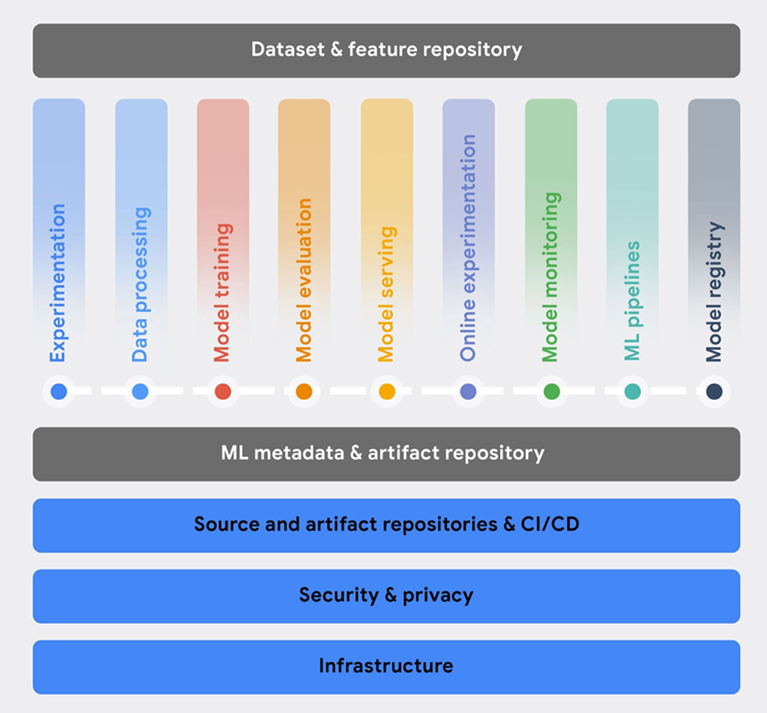

# MLflow

# MLflow의 주요기능

[MLflow Tracking](MLflow/MLflow%20Tracking.md)

[MLflow Registry](MLflow/MLflow%20Registrymd)

[MLflow Inference](MLflow/MLflow%20Inference.md)

[추후 과제](MLflow/%E1%84%8E%E1%85%AE%E1%84%92%E1%85%AE%20%E1%84%80%E1%85%AA%E1%84%8C%E1%85%A6.md)

[2022.01.15 MLflow Tutorial](MLflow/2022%2001%2015%20MLflow%20Tutorial.md)

## MLOps 핵심 기능 중 mlflow는 어디에 적합할까?



# Quick Start

<aside>
💡 가상환경에 설치된 python 버전을 확인한다.

```bash
$ python --version
python 3.7
```

Pypi 를 통해 mlflow를 설치한다.

```bash
pip install mlflow
```

</aside>

### 기본 구성 이해하기

```bash
git clone https://github.com/mlflow/mlflow
cd mlflow/examples/quickstart
```

1. Tracking API 사용 예시
    - 모델 학습 과정에서 parameter, metrics, artifact를 기록하고 버전 관리를 하며, 모델 학습 실행 기록을 볼 수 있다.

`mlflow_tracking.py` 

```python
import os
from random import random, randint
from mlflow import log_metric, log_param, log_artifacts

if __name__ == "__main__":
    print("Running mlflow_tracking.py")

    log_param("param1", randint(0, 100))

    log_metric("foo", random())
    log_metric("foo", random() + 1)
    log_metric("foo", random() + 2)

    if not os.path.exists("outputs"):
        os.makedirs("outputs")
    with open("outputs/test.txt", "w") as f:
        f.write("hello world!")

    log_artifacts("outputs")
```

- `[log_metric](https://mlflow.org/docs/latest/python_api/mlflow.html#mlflow.log_metric)`
- `[log_param](https://mlflow.org/docs/latest/python_api/mlflow.html#mlflow.log_param)`
- `[log_artifacts](https://mlflow.org/docs/latest/python_api/mlflow.html#mlflow.log_artifacts)`

위와 같은 3가지 함수를 가져와 Tracking하는데, 해당 링크를 클릭하여 자세한 함수의 설명을 확인할수 있다. 

```python
python mlflow_tracking.py
```

실행 후에는 `mlruns`와 `outputs` 디렉토리가 생겨있다.

```bash
$ tree .

├── mlflow_tracking.py
├── mlruns
│   └── 0
│       ├── fd97b204ecb149b8bf5bb41674d6287c
│       │   ├── artifacts
│       │   │   └── test.txt
│       │   ├── meta.yaml
│       │   ├── metrics
│       │   │   └── foo
│       │   ├── params
│       │   │   └── param1
│       │   └── tags
│       │       ├── mlflow.source.git.commit
│       │       ├── mlflow.source.name
│       │       ├── mlflow.source.type
│       │       └── mlflow.user
│       └── meta.yaml
└── outputs
    └── test.txt
```

- `metrics`
- `params`
- `artifacts`

위에서 `log_blahblah` 함수로 기록했던 값이 파일로 기록되어 있다. 특히 `metrics` 의 경우는 timestamp가 같이 기록되어 있다.

```bash
7b204ecb149b8bf5bb41674d6287c/metrics$ vi foo
1643963402394 0.6164196006416202 0
1643963402394 1.1171855651628642 0
1643963402395 2.4314951719135935 0
```

폴더 상단에서 (현재와 동일한 경우 ./mlflow/examples/quickstart) `mlflow ui` 명령어로 대시보드용 웹 서버를 띄울 수 있다. 
다만, 서버 컴퓨터에서 실행시키고 (사설망) 접속하고자 하는 경우 `mlflow ui -h 0.0.0.0` 명령어로 실행하면 문제가 해결된다.


### Review

- MLflow는 ML모델을 train, test, validation할 때마다 그 값을 기록해주는 툴이다.
    - ML 모델 학습 이력 관리가 용이하다.
    - 웹 대시보드로 간편하게 관리할 수 있다.
- 모델러가 MLflow 사용방법을 알아야 사용할 수 있다는 점이 단점이긴 하다.
    - 그러나 quick start로도 간단하게 로깅하는 방법은 사용할 수 있다.
    - ML 프레임워크별로 [auto-log](https://mlflow.org/docs/latest/tracking.html#id2) 기능이 있다! 따로 페이지에서 다뤄볼 것이다.
- 서빙까지도 지원한다. 그러나... (아래의 토글에 비교)
- **bentoml vs mlflow (🖱)**
  
  
    |  | mlflow | bentoml |
    | --- | --- | --- |
    | 활용되는 시나리오 | 모델 실험 관리, ML 프로젝트 관리 | 훈련된 모델 제공 및 배포
    (bentoml을 사용하여 mlflow 실험에 기록된 모델을 제공할 수 있다) |
    | 모델 서빙 | REST API로 가능 | REST API로 가능 
    (다른 형식도 제공) |
    | 모델 서빙에서의 차이점 | - 모델 로드와 모델 학습 실행에 중점 | - mlflow에 비해 3~10배 나은 성능을 제공
    - 대용량 리퀘스트 처리 가능
    - 사전 처리, 사후 처리를 포함하는 ‘서비스’를 제공하는 것에 중점
    - 다중 모델 추론, API 서버 고정, Prometheus 엔드 포인트 제공, swagger/open api 엔드 포인트 제공 ... |